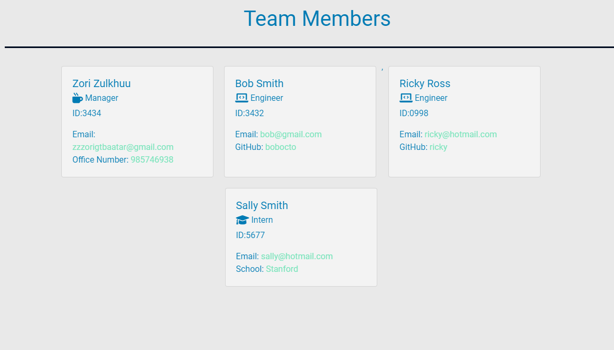

# Team-Profile-Generator

## Description 

This project aims to showcase my ability in utilizing Node CLI to take in information about employees to generate an HTML webpage that displays summaries for each person.



I also ensure all unit tests pass. Demo video available [here](https://www.youtube.com/watch?v=OSgIz4Ces9M).


## Usage

In order to do this project, I used the `inquirer` module to obtain user input with interactive command line prompts.


```JavaScript
function managerQuestions() {
    const questions = [
        {
            name: "managerName",
            message: "What is the team manager's first and last name?",
        },
        {
            name: "managerID",
            message: "What is the team manager's id?",
        },
        {
            name: "managerEmail",
            message: "What is the team manager's email?"
        },
        {
            name: "managerOfficeNum",
            message: "What is the team manager's office number?",
        },
    ];
    inquirer.prompt(questions).then((answers) => {
        const managerData = new Manager(
            answers.managerName,
            answers.managerID,
            answers.managerEmail,
            answers.managerOfficeNum
        );
        employeeArray.push(managerData);
        addEmployee();
    });
}
```

I used the `jest` module to ensure all unit tests pass.

```JavaScript
describe("Employee class", () => {

  describe("Initialization", () => {
    it("should create an object with a name, id, and email if provided valid arguments", () => {
      const employee = new Employee("Sarah", 322, "cat@gmail.com");

      expect(employee.name).toEqual("Sarah");
      expect(employee.id).toEqual(322);
      expect(employee.email).toEqual("cat@gmail.com");
    });

    describe("Get Role", () => {
      it("should return 'Employee' when getRole() is called", () => {
        const employee = new Employee("Sarah", 322, "cat@gmail.com");
        expect(employee.getRole()).toEqual("Employee");
      });
    });
  });
}); 
```

## Links

There is no deployed site for this app.

[Project Repository](https://github.com/zzzorigtbaatar/Team-Profile-Generator)

## Credits

* Jerome Chenette, UC Berkeley Extension Coding BootCamp

* https://jestjs.io/docs/getting-started

* https://www.npmjs.com/package/inquirer


## License

[LICENSE](/LICENSE)

## Contact

https://www.linkedin.com/in/zorizulkhuu/

https://github.com/zzzorigtbaatar